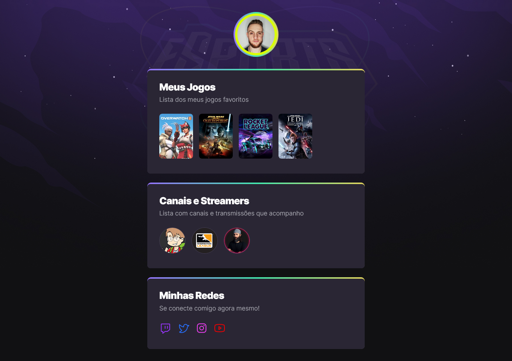

# NLW eSports - Trilha Explorer

Esse é um projeto super legal que desenvolvi durante o evento **NLW eSports**, realizado pela @Rocketseat 🚀. 

O conceito utilizado na trilha **Explorer** era o de criar uma página com os games e streamers preferidos do usuário (no caso, eu), seguindo a temática de eSports (tema do evento).

Apesar de simples, esse projeto me ajudou muito a aprofundar em **HTML e CSS**, além de ter ficado muito bonito 💻.

As aulas e didática do grande [@maykbrito](https://github.com/maykbrito) foram o elemento chave para me ajudar a entender conceitos que antes pareciam complexos, como as *animations* e as *transitions* do CSS.

🔗 Para ver o resultado, é só [clicar aqui](https://framesgabriel.github.io/nlw-esports-explorer/).

## 🛠️ Tecnologias Utilizadas

